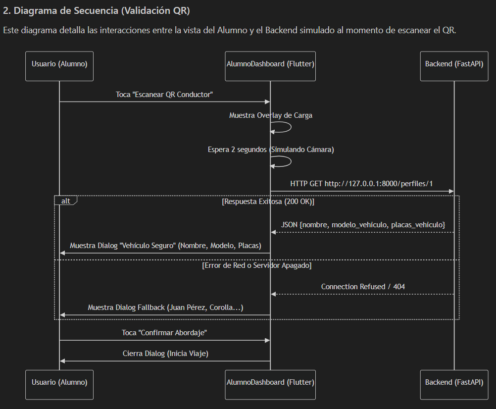
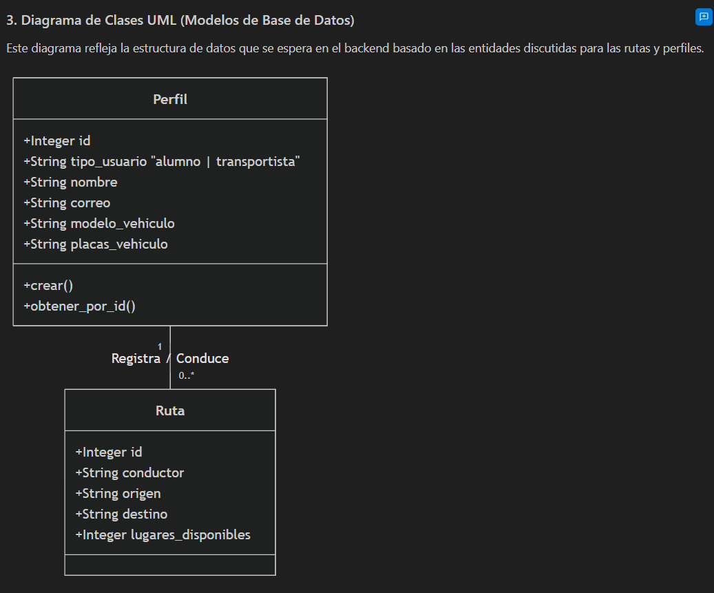
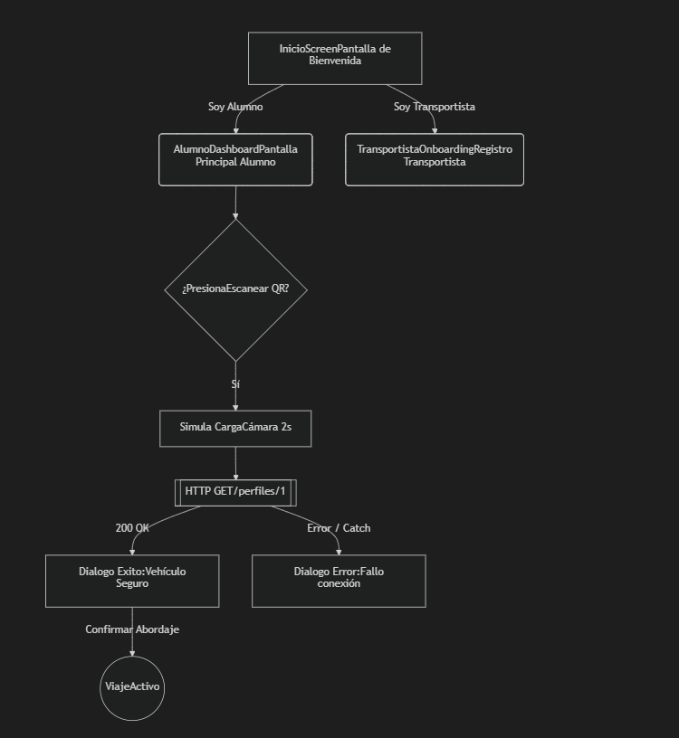

# Nexus Track — Para la movilidad

Hola, esta es el avance de **Nexus**. Un sistema diseñado para facilitar y asegurar la movilidad de los estudiantes. El proyecto está dividido en dos partes principales: el frontend desarrollado en Flutter y el backend en FastAPI. A continuación se muestra la estructura del proyecto, las tecnologías utilizadas y los diagramas que representan la arquitectura y los flujos de usuario. Se utilizo una arquitectuara cliente servidor.
---

##  Estructura del Proyecto

El proyecto está organizado en las siguientes carpetas principales:

```bash
Nexus-workspace/
├── Nexus/                            # Directorio del Frontend
│   └── Frontend/                     # Código fuente de la app Flutter (Android / iOS)
├── nexus_api/                        # Código fuente del Backend (FastAPI + SQLite)
│   ├── routers/                      # Módulos de rutas del API
│   ├── database.py                   # Configuración de SQLAlchemy
│   ├── models.py                     # Modelos de Base de Datos
│   └── requirements.txt              # Dependencias de Python
└── arquitectura_documentacion_nexus/ # Documentación visual de arquitectura
    └── image/                        # Diagramas exportados en formato PNG
```

---

##  Tecnologías Utilizadas

### Frontend (Flutter)
- **Dart** y **Flutter SDK** para desarrollo multiplataforma.
- **Material 3 Design Principles** para una experiencia visual premium, limpia y moderna.
- **Simulación de Escaneo QR** interactivo con estados de carga animados.
- Integración segura con API Backend mediante peticiones HTTP asíncronas con fallbacks locales automáticos.

### Backend (FastAPI)
- **Python 3.10+** con **FastAPI** para APIs REST de alto rendimiento y documentación automática (Swagger/ReDoc).
- **SQLAlchemy (ORM)** y **SQLite** para gestión relacional y persistencia local de rutas de viaje y perfiles.
- **Pydantic V2** para validación estricta y serialización rápida de datos.

---

##  Arquitectura del Sistema

Los diagramas a continuación representan el diseño arquitectónico y de flujos de la aplicación actual. 

### 1. Flujo de Usuario (User Flow)
Este diagrama ilustra la navegación principal del sistema, mostrando las pantallas iniciales y el recorrido interactivo que sigue un alumno para iniciar un escaneo de código QR:



### 2. Diagrama de Secuencia (Validación QR con el Backend)
Muestra la comunicación interactiva y en tiempo real entre el dispositivo del Alumno (Frontend) y los servicios de backend para verificar la validez del conductor:



### 3. Modelo de Clases (Base de Datos)
Representa la relación de datos lógica implementada para la persistencia del sistema, vinculando conductores y perfiles con rutas de viajes compartidos:



---

## Guía de Inicio Rápido

Sigue estos pasos para levantar el entorno de desarrollo de forma local.

###  1. Levantar el Backend (FastAPI)

1. Navega a la carpeta del backend:
   ```powershell
   cd nexus_api
   ```
2. Crea e inicia tu entorno virtual:
   ```powershell
   python -m venv venv
 
3. Instala las dependencias requeridas:
   ```powershell
   pip install -r requirements.txt
   ```
4. Inicia el servidor de desarrollo:
   ```powershell
   python main.py
   ```
   *El servidor estará escuchando en `http://192.168.100.6:8000`. Puedes explorar la documentación interactiva en `http://192.168.100.6:8000/docs`.*

---

###  2. Levantar el Frontend (Flutter)

1. Navega al directorio del frontend:
   ```powershell
   cd Nexus/Frontend
   ```
2. Obtén los paquetes de Flutter necesarios:
   ```powershell
   flutter pub get
   ```
3. Ejecuta la aplicación en un dispositivo físico, simulador o entorno web:
   ```powershell
   flutter run
   ```

> [!TIP]
> **Simulación QR offline**: Si ejecutas la aplicación móvil y el servidor backend no está encendido, la app utilizará un mecanismo de fallback inteligente que cargará un conductor mockeado de demostración (`Juan Pérez` en un `Toyota Corolla`), garantizando una demostración funcional sin fallos de pantalla.

---

##  Funcionalidades Próximas a Implementar
- [ ] Implementación de la base de datos de perfiles reales (`/perfiles/` en FastAPI) para reemplazar los mocks del frontend.
- [ ] Lectura de cámara física para QR Scanner en Flutter utilizando paquetes oficiales como `mobile_scanner`.
- [ ] Implementación de filtros de rutas por origen/destino del alumno.
